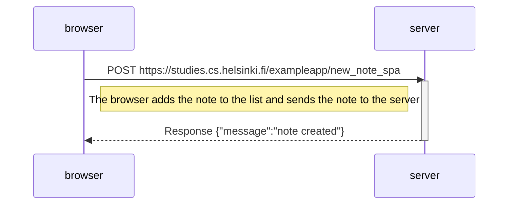

```mermaid
sequenceDiagram
    participant browser
    participant server

    browser->>server: POST https://studies.cs.helsinki.fi/exampleapp/new_note_spa
    activate server
    Note right of browser: The browser adds the note to the list and sends the note to the server
    server-->>browser: Response {"message":"note created"}
    deactivate server
```